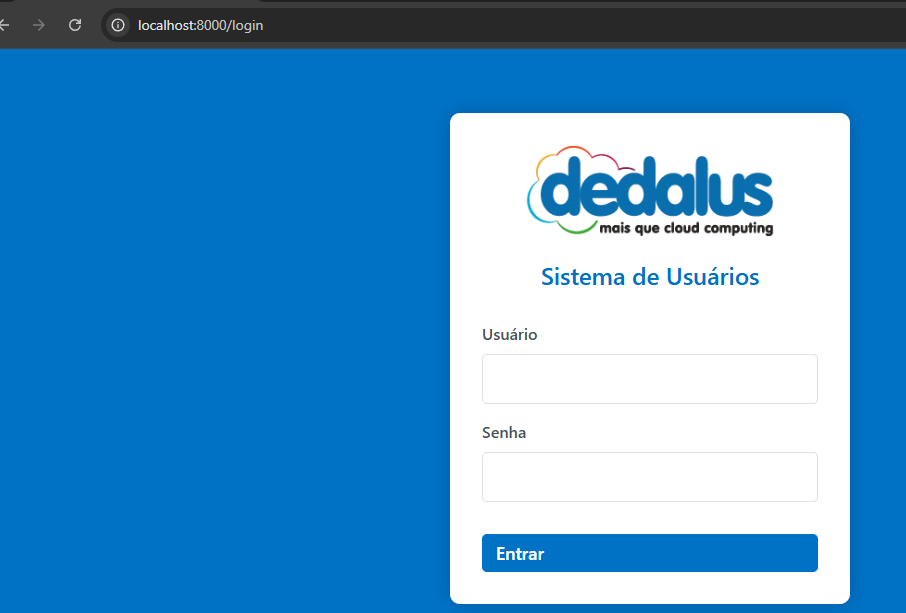
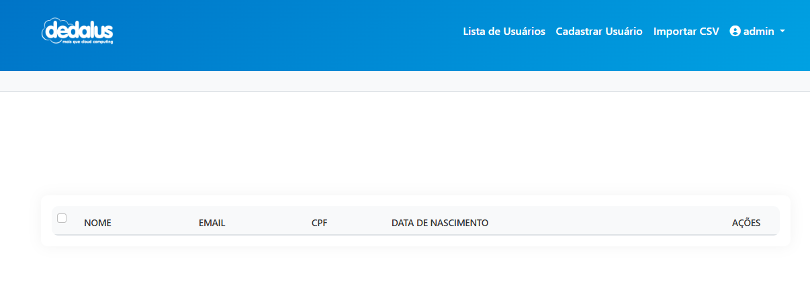
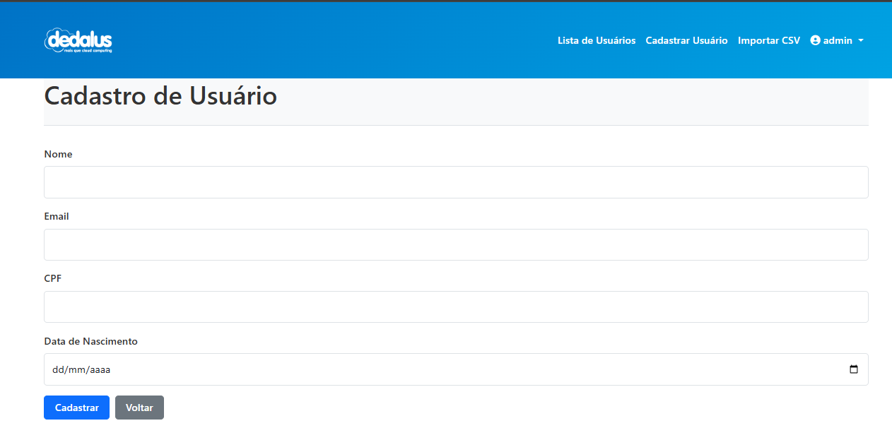
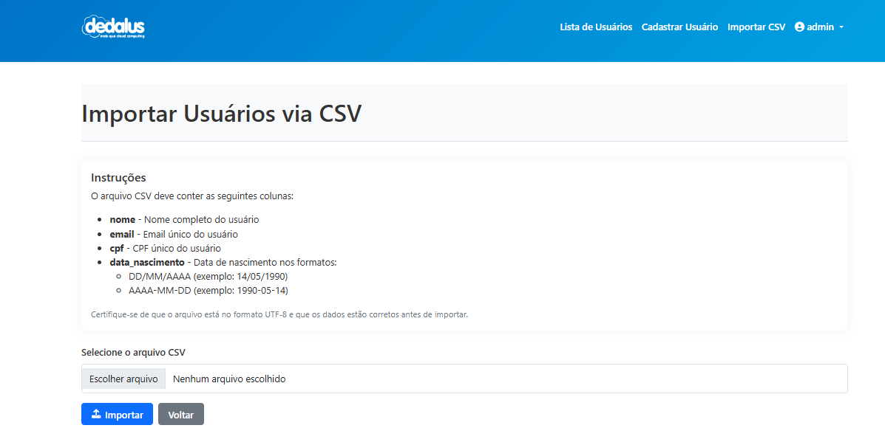
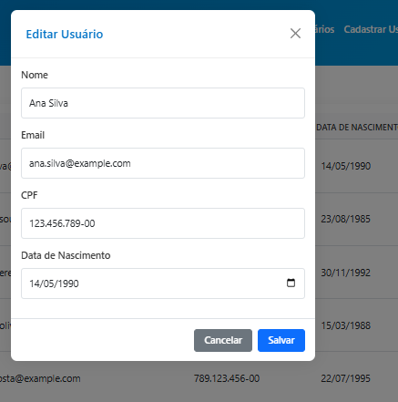

# Sistema de Gerenciamento de Usuários - Dedalus


## Índice

- [Sobre o Projeto](#-sobre-o-projeto)
- [Tecnologias Utilizadas](#-tecnologias-utilizadas)
- [Arquitetura](#-arquitetura)
- [Estrutura do Projeto](#-estrutura-do-projeto)
- [Funcionalidades](#-funcionalidades)
- [Configuração do Ambiente](#-configuração-do-ambiente)
- [Como Executar](#-como-executar)
- [API Endpoints](#-api-endpoints)
- [Modelo de Dados](#-modelo-de-dados)
- [Decisões de Design](#-decisões-de-design)
- [Segurança](#-segurança)
- [Screenshots do Sistema ](#-screenshots-do-sistema-)

## Sobre o Projeto

Sistema de gerenciamento de usuários desenvolvido com FastAPI e SQLAlchemy, oferecendo uma interface moderna e responsiva para operações CRUD de usuários, com suporte a importação via CSV.

## Tecnologias Utilizadas

### Backend
- **FastAPI**: Framework web moderno e rápido para construção de APIs
- **SQLAlchemy**: ORM para interação com banco de dados
- **Pydantic**: Validação de dados e serialização
- **Python 3.7+**: Linguagem de programação principal
- **SQLite**: Banco de dados relacional

### Frontend
- **Bootstrap 5**: Framework CSS para interface responsiva
- **JavaScript**: Vanilla JS para interações dinâmicas
- **Jinja2**: Engine de templates
- **Font Awesome**: Ícones vetoriais

## Arquitetura

O projeto segue uma arquitetura MVC (Model-View-Controller) adaptada para FastAPI:

```
app/
├── database/         # Configuração do banco de dados
├── models/          # Modelos SQLAlchemy
├── static/          # Arquivos estáticos (CSS, JS, imagens)
├── templates/       # Templates Jinja2
└── main.py         # Ponto de entrada e rotas
```

### Decisões Arquiteturais

1. **Separação de Responsabilidades**:
   - Models: Definição das entidades e lógica de negócios
   - Templates: Apresentação e interface do usuário
   - Controllers (rotas): Lógica de controle e fluxo de dados

2. **Banco de Dados**:
   - SQLite: Escolhido pela simplicidade e portabilidade
   - Migrations automáticas com SQLAlchemy

3. **Frontend**:
   - Templates server-side para melhor SEO e carregamento inicial
   - JavaScript para interações assíncronas
   - Design responsivo mobile-first

## Como Executar

### Pré-requisitos

- Python 3.7 ou superior
- pip (gerenciador de pacotes Python)
- Navegador web moderno

### Instalação

1. Clone o repositório:
```bash
git clone https://github.com/jgguida/cadastro_usuarios.git
cd cadastro_usuarios
```

2. Crie e ative um ambiente virtual:
```bash
python -m venv venv
source venv/bin/activate  # Linux/Mac
venv\Scripts\activate     # Windows
```

3. Instale as dependências:
```bash
pip install -r requirements.txt
```

4. Execute a aplicação:
```bash
python run.py
```

5. Acesse no navegador:
```
http://localhost:8000
```

## Funcionalidades

### 1. Gestão de Usuários

#### Listagem de Usuários
- Exibição em tabela responsiva
- Ordenação por colunas
- Ações rápidas (editar/excluir)
- Seleção múltipla para exclusão em lote

#### Cadastro de Usuário
- Validação em tempo real
- Verificação de duplicidade de email/CPF
- Formatação automática de CPF
- Feedback visual de erros

#### Edição de Usuário
- Modal interativo
- Preservação dos dados existentes
- Validação dos campos
- Atualização em tempo real

#### Exclusão de Usuário
- Confirmação de exclusão
- Exclusão individual ou em lote
- Feedback de sucesso/erro

### 2. Importação CSV

- Suporte a upload de arquivos CSV
- Validação do formato dos dados
- Processamento em lote
- Tratamento de erros por linha
- Feedback detalhado do processo

## Modelo de Dados

### Usuário (User)

```python
class User(Base):
    id: int (primary_key)
    nome: str
    email: str (unique)
    cpf: str (unique)
    data_nascimento: date
```

### Validações
- Email: Formato válido e único
- CPF: Formato válido e único
- Data de Nascimento: Formato DD/MM/AAAA ou YYYY-MM-DD

##  Segurança

1. **Validação de Dados**:
   - Sanitização de inputs
   - Validação de formatos
   - Prevenção de SQL Injection via ORM

2. **Proteção contra Ataques**:
   - CSRF Token nas requisições POST
   - Validação de tipos de arquivo
   - Escape de dados nos templates

3. **Boas Práticas**:
   - Senhas não são armazenadas
   - Logs de operações críticas
   - Tratamento de erros apropriado

##  API Endpoints

### Usuários

```
GET    /api/users          # Lista todos os usuários
POST   /api/users          # Cria novo usuário
GET    /api/users/{id}     # Obtém usuário específico
PUT    /api/users/{id}     # Atualiza usuário
DELETE /api/users/{id}     # Remove usuário
```

### Importação CSV

```
POST   /importar-csv       # Importa usuários via CSV
```

## Interface

1. **Design System**:
   - Cores corporativas Dedalus
   - Tipografia consistente
   - Componentes reutilizáveis
   - Feedback visual claro

2. **Responsividade**:
   - Layout adaptativo
   - Mobile-first
   - Breakpoints customizados

3. **Acessibilidade**:
   - ARIA labels
   - Contraste adequado
   - Navegação por teclado

## Notas de Desenvolvimento

### Decisões Técnicas

1. **FastAPI vs Flask**:
   - Melhor performance
   - Documentação automática
   - Validação de tipos nativa
   - Suporte a async/await

2. **SQLite vs PostgreSQL**:
   - Simplicidade de configuração
   - Portabilidade
   - Adequado para escala inicial
   - Fácil migração futura

3. **Vanilla JS vs Framework**:
   - Menor overhead
   - Melhor performance
   - Simplicidade de manutenção
   - Sem dependências extras

### Melhorias Futuras

1. **Performance**:
   - Paginação na listagem
   - Cache de consultas frequentes
   - Lazy loading de imagens

2. **Funcionalidades**:
   - Filtros avançados
   - Exportação de dados
   - Histórico de alterações
   - Autenticação de usuários

3. **Infraestrutura**:
   - Containerização
   - CI/CD
   - Monitoramento
   - Backup automatizado

## Teste

Tudo isso pode ser testado no link enviado por email.

## Screenshots do Sistema 

### Tela de Login


### Lista de Usuários


### Cadastro de Usuário


### Importação de CSV


### Usuários Listados


### Edição de Usuário


